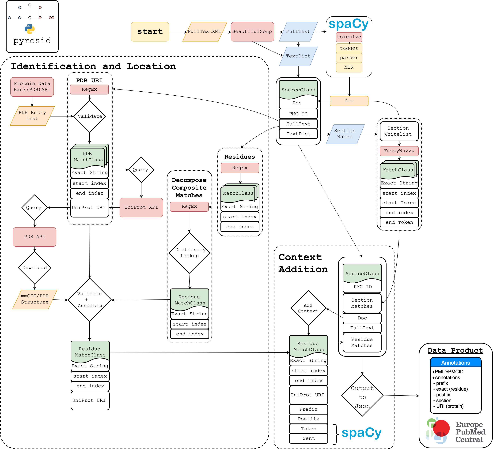

.. pyresid documentation master file, created by
   sphinx-quickstart on Mon Mar 12 10:58:54 2018.
   You can adapt this file completely to your liking, but it should at least
   contain the root `toctree` directive.

.. .. image:: ./_static/images/west-life.png
   :height: 100px
   :align: left
.. .. image:: ./_static/images/Hartree_Centre_Logo.jpg
   :height: 100px
   :align: right

Welcome to the docs for `pyresid`
=================================

Python tools for mining Protein Residues from Fulltext articles using PMC number, ePMC and PDB.
Identify sentences in structural publications that refer to local features of a protein.

.. toctree::
   :maxdepth: 2
   :caption: Contents:

   functions
   classes
   license

Indices and tables
==================

* :ref:`genindex`
* :ref:`modindex`
* :doc:`license`
* :ref:`search`

Structure
=========

